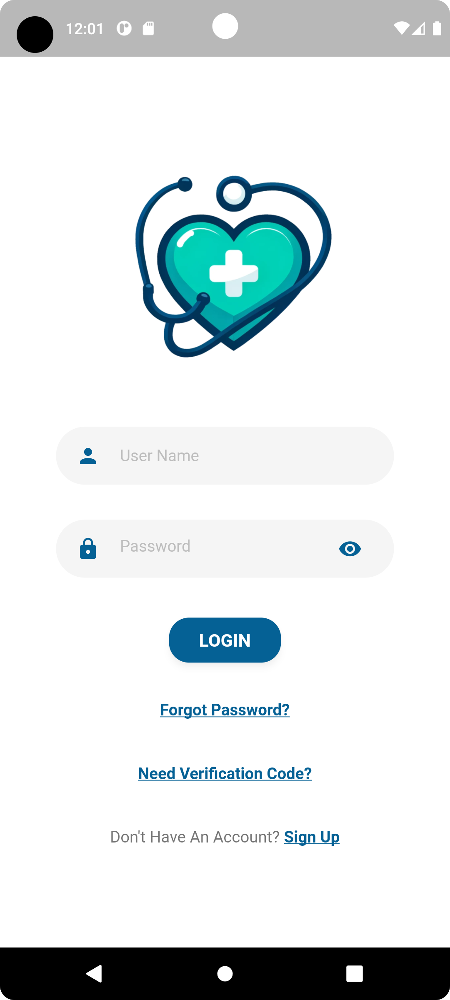
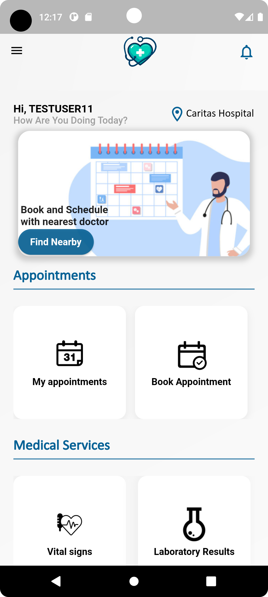
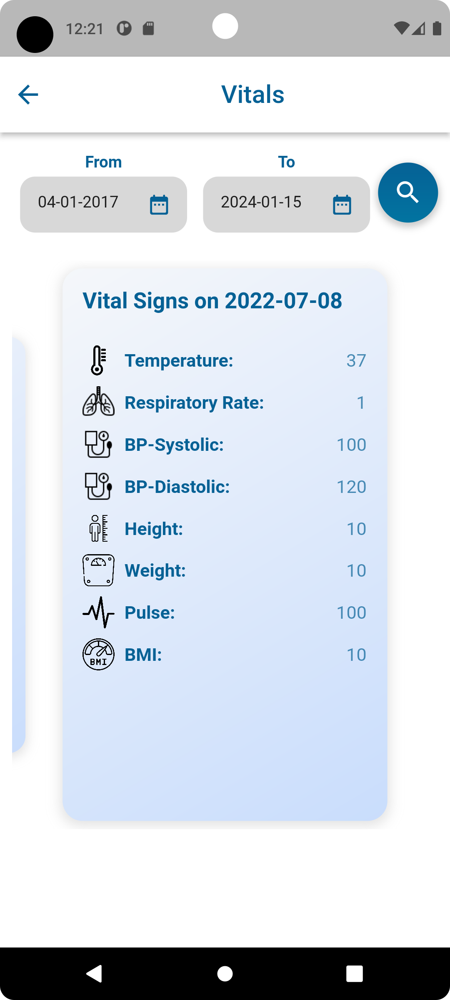
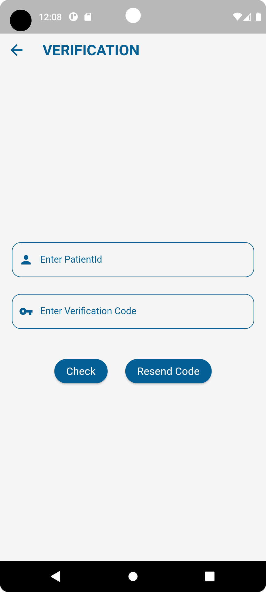

# 🩺 Patient Portal - Your Health Companion

Welcome to the Patient Portal, an intuitive and user-friendly mobile app designed to revolutionize the way patients interact with their healthcare journey. From managing appointments to accessing medical records, Patient Portal puts healthcare in your hands.

## 🌟 Features

### 🚪 **Login & Sign Up**
Secure and easy access to your health information.

  
  

### 🏠 **Home**
Your health dashboard at a glance.

  

### 📅 **Appointments**
Manage your healthcare appointments with ease.

  
  

### 💊 **Medication & Health Tracking**
Stay on top of your medications and vitals.

  
  

### 📈 **Lab Results & Radiology Reports**
Access your medical reports anytime, anywhere.

  
  

### 👨‍⚕️ **My Doctors**
Keep track of your healthcare providers.

  

### 📱 **Mobile Verification**
Secure your account with mobile verification.

  

## 🚀 Getting Started

To start using the Patient Portal app:

 bash
git clone https://github.com/WasimAnabtawi/patient-portal.git
cd patient-portal
flutter run

🧰 Technologies Used
Flutter: For a seamless cross-platform user experience.
Firebase: For secure backend services.
RESTful APIs: For integration with healthcare systems.
🤝 Contributing
Contributions to improve Patient Portal are welcome. Feel free to fork this repository and submit your pull requests.

📄 License
This project is licensed under the MIT License - see the LICENSE.md file for details.

📞 Contact
Project Link: https://github.com/WasimAnabtawi/patient-portal

  &copy; [2024] by [Wes]. All Rights Reserved.

 
