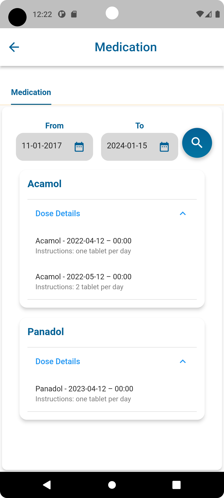

# 🩺 Patient Portal - Your Health Companion

Welcome to the Patient Portal, an intuitive and user-friendly mobile app designed to revolutionize the way patients interact with their healthcare journey. From managing appointments to accessing medical records, Patient Portal puts healthcare in your hands.

## 🌟 Features

### 🚪 **Login & Sign Up**
Secure and easy access to your health information.
-  
- 

### 🏠 **Home**
Your health dashboard at a glance.
- 

### 📅 **Appointments**
Manage your healthcare appointments with ease.
- 
- 

### 💊 **Medication & Health Tracking**
Stay on top of your medications and vitals.
- 
- 

### 📈 **Lab Results & Radiology Reports**
Access your medical reports anytime, anywhere.
- 
- 

### 👨‍⚕️ **My Doctors**
Keep track of your healthcare providers.
- 

### 📱 **Mobile Verification**
Secure your account with mobile verification.
- 

## 🚀 Getting Started

To start using the Patient Portal app:

```bash
git clone https://github.com/WasimAnabtawi/patient-portal.git
cd patient-portal
flutter run

🧰 Technologies Used
Flutter: For a seamless cross-platform user experience.
Firebase: For secure backend services.
RESTful APIs: For integration with healthcare systems.
🤝 Contributing
Contributions to improve Patient Portal are welcome. Feel free to fork this repository and submit your pull requests.

📄 License
This project is licensed under the MIT License - see the LICENSE.md file for details.

📞 Contact
Project Link: https://github.com/WasimAnabtawi/patient-portal

<p align="center">
  &copy; [Current Year] by [Your Name or Organization]. All Rights Reserved.
</p>
```
